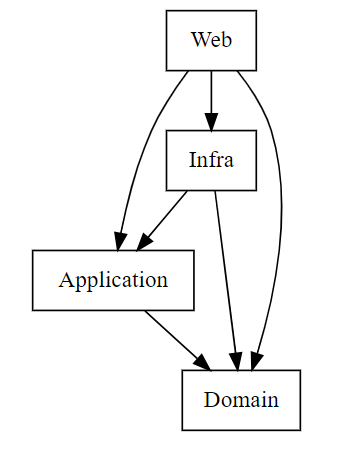

# Dependency tests

## What is it ?

This project run unit tests that verify if there is forbidden dependencies for a specific namespace.

It allow use to be sure of the dependencies between projects automaticly.

The unit tests in the project test dependancies on the Buniness layer only.

## Dependencies in descending layers

### Web
Accesses all layers.

Dependency injection is configured in the `Web` layer.

### Application

Only has access to the `Domain`.

### Infra

Accesses the `Application` and the `Domain`.

Repositories implementations in `Infra` must inherit from the `Application` side interface.

The `Infra` must know the Domain-side models, as the repositories return a `Domain` model and not the DAOs on
the `Infra` side.

### Domain

Does not access any layers.

---

:warning: A reference to a constant property is not see as an external dependency.
This is due to the way a constant property is compiled in C#. Indeed, after compilation, a reference to a constant
property is replaced by the value of the constant (
see [there](https://sharplab.io/#v2:CYLg1APgAgTAjAWAFBQMwAJboMLoN7LpGYYDGA9gHYDOALpnAAzoDKtATgJaUDm2VddAF50AIlrkJogNzF0hYmgYA2BszZdebAIa1OpYWNq7tM5AqJKoAFnQBZABQBKfBfQBfZJ6RzkVmOgAIq4+ihg26ABaziFycgD08ei0ABac1OgAbtpc2gBGADYApujp6NRF9ABm7OQAtujaKqWUjZSSKUXs6JTadUXUAA7apEUANKX0AO6cBQXoANZFRYPJnW4JSQXcC8nkayWDtYNdtACejVW0XegUdYOzupxUG8TZ3e9whtgAdBrcPB0elI0leRESazK704+WKpQyFWqtQaTQoNHo3DaHRuvX6QxG40m6Bmc3QeRK7BWBQJwDB6AheQuqRK2QKAFcSuQqgdbgJ6EdyCd2OdLtduncHtS9C9QnEsjl5ewAiJfv9ePx0bI6VA4ABOBzvGBOUGyjxeIA)
for an example of this behaviour)